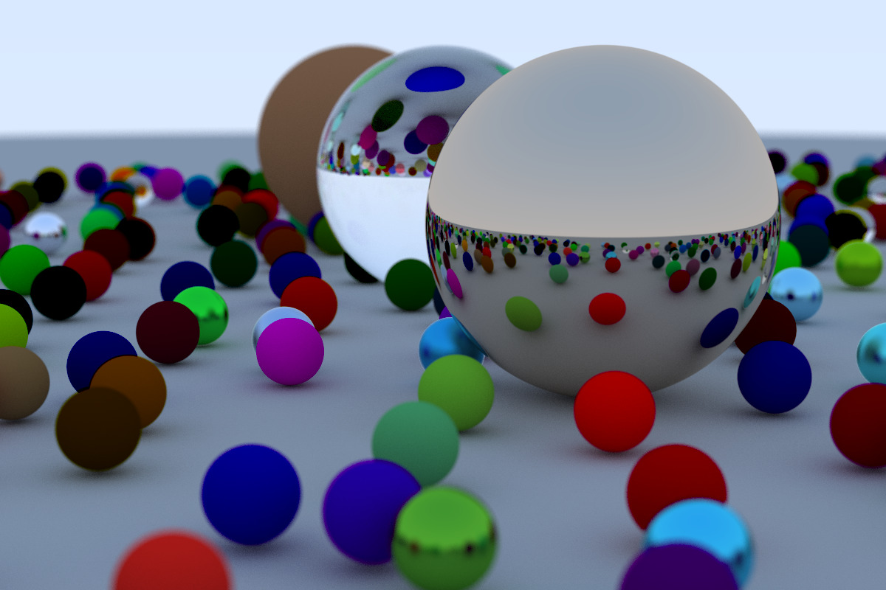

# A Rusty Raytracer

A Rust implementation of the [Ray Tracing in one Weekend] book / tutorial.

The initial version rendered a 1200 x 800 pixel image in about 19.5 minutes
using eight CPU cores. The current implementation uses a QuadTree from [sunsided/space-partitioning]
as a proxy for a 3D space partitioning implementation, which reduced
the rendering time to 7.1 minutes.

[Ray Tracing in one Weekend]: https://raytracing.github.io/books/RayTracingInOneWeekend.html
[sunsided/space-partitioning]: https://github.com/sunsided/space-partitioning
